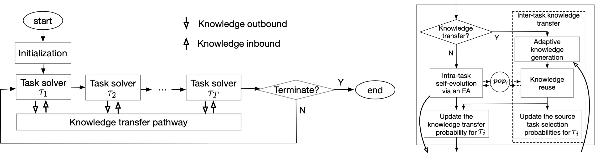

# Evolutionary Multi-task Optimization with Adaptive Knowledge Transfer
## Envs
The following software environments are required. The code is only tested on linux OS. If you want to run on other OS, some equivalent environments should be set properly.
```
cmake >= 3.2
g++ >= 6.4.0; use c++11 standard
python >= 3.0
```

## Build and Run with default arguments
```
git clone https://github.com/haoxuhao/AEMTO.git
cd AEMTO
pip install -r requirements.txt
mkdir build && cd build && cmake .. && make -j
cd ../bin
./AEMTO # && ./MATDE && ./SBO && ./MFEA
```
The detailed results are recorded in `bin/Results/*/*.json`. 

## Run with specified arguments
File `bin/run.sh` lists some useful scripts.

# Acknowledgements
Open source softwares in `oss`: 
- [Eigen](https://eigen.tuxfamily.org/index.php?title=Main_Page)
- [brent](https://people.math.sc.edu/Burkardt/cpp_src/brent/brent.html) 
- [jsoncpp](https://github.com/nlohmann/json)

and the base version of MATDE from author of paper [MaTEA](https://ieeexplore.ieee.org/abstract/document/8727933/).

